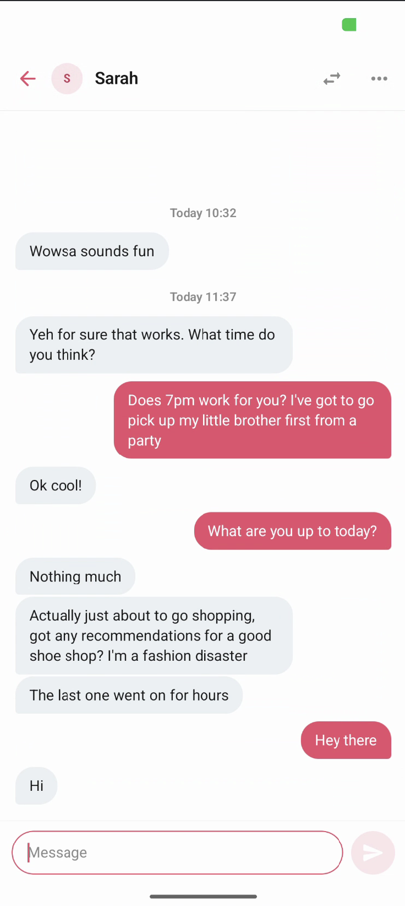
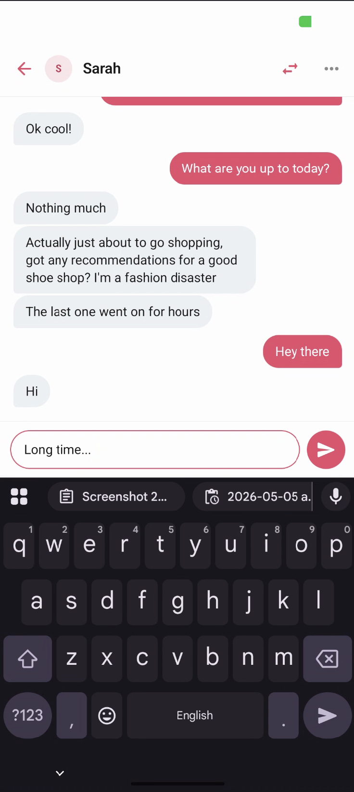

# Muzz Chat — Android Take-Home

A single-screen chat between two fixed local users, built to the [Muzz — Android Exercise 2 - Chat (2023).pdf](Muzz%20%E2%80%94%20Android%20Exercise%202%20-%20Chat%20%282023%29.pdf) brief. Newest messages at the bottom, bubbles aligned by sender, day/time section headers on >1h gaps, tight spacing for rapid same-sender messages, room-backed persistence with reactive UI, and a toolbar toggle to send the next message as the other user.

<p align="center">
  
  &nbsp;&nbsp;&nbsp;
  
</p>

## Running

Open in Android Studio (Ladybug or newer for AGP 9.x), run the **app** configuration on a device or emulator with **API 24+**. First launch seeds the database with the conversation from the brief's screenshot.

```bash
./gradlew :feature:chat:testDebugUnitTest      # JVM unit tests (15 tests)
./gradlew :feature:chat:connectedDebugAndroidTest   # Compose UI tests (3 tests, needs emulator)
./gradlew :app:assembleDebug                   # Debug APK
```

## Architecture

**MVI on top of feature-scoped Clean Architecture.** Unidirectional flow: View → Intent → ViewModel → State → View. State is derived from a single `combine(repo.observeMessages(), draft, activeSender)` pipeline so Room's `Flow` stays the source of truth — there's no manual reducer cache to keep in sync.

### Module structure

```
:app                    Application + MainActivity (Hilt entry points)
:core:designsystem      Compose theme — MuzzColors, MuzzTypography, MuzzTheme
:feature:chat           The whole feature: ui/ + domain/ + data/ + di/
```

### Inside `:feature:chat`

```
ui/         ChatScreen (stateless), ChatRoute (stateful), ChatViewModel,
            components/, mapper/ (MessageListMapper, DayHeaderFormatter), state/
domain/     Message, User, ChatRepository (interface)
data/       Room — AppDatabase, MessageDao, MessageEntity, MessageSeed,
            DefaultChatRepository (impl), all `internal`
di/         Hilt modules — DatabaseModule, RepositoryModule, ClockModule
```

The `domain.ChatRepository` interface is the only seam between `ui` and `data`. UI never imports a Room type. The `data` package is `internal` to the module, so `:app` can't reach past the domain contract.

`MessageListMapper` is a pure function `(List<Message>, viewerId) → List<ChatListItem>` — every header / tight-spacing decision lives there, fully unit-testable without Android.

## Key decisions & assumptions

| Decision                                                    | Rationale                                                                                                                                                                                                                                                                                                                |
|-------------------------------------------------------------|--------------------------------------------------------------------------------------------------------------------------------------------------------------------------------------------------------------------------------------------------------------------------------------------------------------------------|
| **Compose + Material 3**                                    | Brief shows pixel-aligned bubbles; Compose iterates faster than XML.                                                                                                                                                                                                                                                     |
| **Hilt for DI**                                             | Standard for Android; demonstrates DI fluency across `@HiltViewModel`, `@Binds`, `@Provides`, `@InstallIn`.                                                                                                                                                                                                              |
| **Room with `Flow<List<…>>`**                               | Brief's "Bonus Points" — reactive observables straight from DB. UI auto-refreshes on insert.                                                                                                                                                                                                                             |
| **`activeSender` ≠ viewer**                                 | Toggling only changes who the *next* message is attributed to. The viewer is fixed as `Me`, so existing bubbles keep their alignment when toggled. (Earlier draft conflated the two — every existing bubble flipped sides on toggle, which felt wrong for the brief's intent of "trigger messages from the other user".) |
| **Tight-spacing flag on the *earlier* message**             | Per literal reading of the brief: "the message *after it* was sent less than 20 seconds afterwards".                                                                                                                                                                                                                     |
| **Header gap test is strict `>` 1h**                        | Exactly 1h apart → no header. 1h + 1ms → header.                                                                                                                                                                                                                                                                         |
| **Date format rules**                                       | `Today HH:mm`, `Yesterday HH:mm`, `{DayName} HH:mm` for last 7 days, `d MMM HH:mm` older.                                                                                                                                                                                                                                |
| **`java.time` via core-library desugaring**                 | minSdk 24; modern API without an extra dep like `kotlinx-datetime`.                                                                                                                                                                                                                                                      |
| **Manual DI for `Clock`/`ZoneId`**                          | Injected via `ClockModule` so tests can pin time deterministically.                                                                                                                                                                                                                                                      |
| **Two-way messaging = toolbar swap-icon toggle**            | Brief allows "random replies, a toggle, or whatever else". Toggle is deterministic — better for a recorded demo than random replies.                                                                                                                                                                                     |
| **DB pre-populated on first launch**                        | App opens with a realistic conversation matching the brief's screenshot.                                                                                                                                                                                                                                                 |
| **Reverse-layout LazyColumn**                               | Newest at bottom for free; auto-pins on send.                                                                                                                                                                                                                                                                            |
| **Stable list keys** (`bubble-{id}`, `header-{epoch}-{id}`) | Smooth item animations and correct recomposition.                                                                                                                                                                                                                                                                        |
| **Language**                                                | Assumed that the app will only be in English                                                                                                                                                                                                                                                                             |


## Testing strategy

Pyramid: cheap layer-isolated tests for the logic, a small set of UI tests at the boundary.

| Suite                       | What it covers | Where |
|-----------------------------|---|---|
| `MessageListMapperTest` (8) | Header insertion at >1h boundary, tight-spacing 20s boundary + same-sender check, isMine via viewerId, empty input | `feature:chat` test |
| `ChatViewModelTest` (7)     | DraftChanged, blank-draft no-op, send trims + clears + dispatches, ToggleUser flips active sender, **regression: toggling does not flip existing alignment**, send-as-Sarah persists with `senderId = "sarah"`, repo flow drives state items | `feature:chat` test |
| `ChatScreenTest` (2)        | Bubble alignment (mine right / theirs left via `boundsInRoot.center.x`), **regression**: typing enables send + click emits SendClicked | `feature:chat` androidTest |

Skipped on purpose: DAO / Room (standard SELECT/INSERT, low risk), `DefaultChatRepository` (tests would re-prove `flow.map`), tight-spacing pixel measurements (mapper unit tests own this), full `ChatRoute` end-to-end (would mostly test Hilt + Compose lifecycle, not our code).

## Branching & Commits
- Ideally, there should be multiple commits and branches being done over time so that evaluation can be easy as well
- For this project multiple commits are present to demonstrate knowledge but they have been done over a few hours because of time limitation and personal commitments.
- All the code has been pushed to master directly. Ideally i would have done it in multiple branches, created PRs, merged small branches into a feature branch and then merged feature branch into master.

## What I'd do with more time

- **`DayHeaderFormatter` direct unit tests** for each date branch (`Today`/`Yesterday`/`{DayName}`/`d MMM`) — currently only one Instant is exercised transitively via the mapper.
- **One end-to-end smoke test** with `@HiltAndroidTest` + in-memory Room (via `@TestInstallIn`) hitting `MainActivity` — the only thing pure UI tests don't cover is the `ChatRoute → ViewModel` wire-up.
- **Avatar asset** — currently the toolbar shows a Pink-on-Pink "S" placeholder; brief shows a circular avatar image.
- **Long-press affordance** on bubbles (copy/delete).
- **Detekt + ktlint** in CI.
- Add toasts or todos/logs on buttons/clickable items which have no implementations. e.g. 3 dots (more)
- **Configuration change handling for the draft** — currently lives in the VM's `MutableStateFlow`, so it survives recomposition and process death of the host (because VM survives), but explicit `SavedStateHandle` would be cleaner.
- **Branching & Commits** better branching and commit history as mentioned in the specific section.

## Limitations

- minSdk 24, JDK 17, AGP 9.2.0, Kotlin 2.1.0 — bleeding-edge toolchain. Compatibility constraints (notably Hilt-no-plugin and `android.disallowKotlinSourceSets=false` for KSP) are documented above.
- No tablet/landscape-specific layout — Compose layout adapts but bubble max width could be tuned.
- No accessibility audit beyond default content descriptions on the icon buttons.
- `MainActivity` is the single Activity; no navigation library since there's only one destination.

## Project layout reference

```
.
├── app/                                    Composition root
│   └── src/main/java/com/muzz/chatapp/
│       ├── ChatApplication.kt              @HiltAndroidApp(Application::class)
│       └── MainActivity.kt                 @AndroidEntryPoint(ComponentActivity::class)
├── core/
│   └── designsystem/                       MuzzTheme + tokens
└── feature/
    └── chat/
        ├── src/main/java/com/muzz/chatapp/feature/chat/
        │   ├── ui/
        │   │   ├── ChatRoute.kt            hiltViewModel(), collects effects
        │   │   ├── ChatScreen.kt           Stateless: ChatState + (ChatIntent) -> Unit
        │   │   ├── ChatViewModel.kt        @HiltViewModel; combine() over repo + draft + sender
        │   │   ├── components/             ChatTopBar, MessageList, MessageBubble, DayHeader, MessageInputBar
        │   │   ├── mapper/                 MessageListMapper, DayHeaderFormatter
        │   │   └── state/                  ChatState, ChatIntent, ChatListItem
        │   ├── domain/                     Message, User, ChatRepository (interface)
        │   ├── data/                       Room (internal); DefaultChatRepository
        │   └── di/                         DatabaseModule, RepositoryModule, ClockModule
        ├── src/test/                       JVM unit tests
        └── src/androidTest/                Compose UI tests
```
